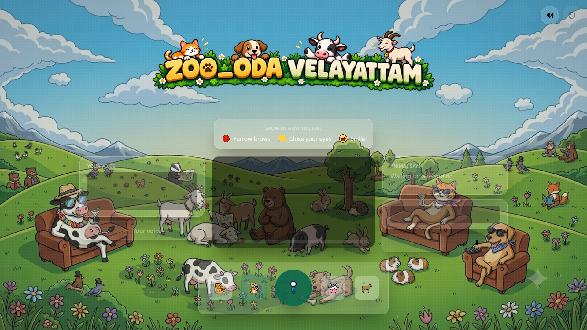
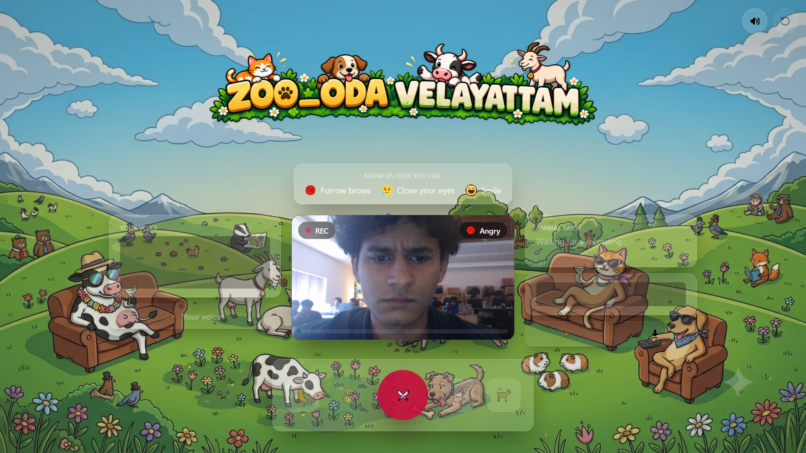
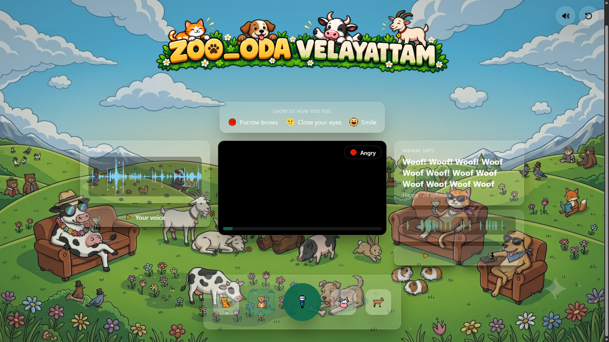
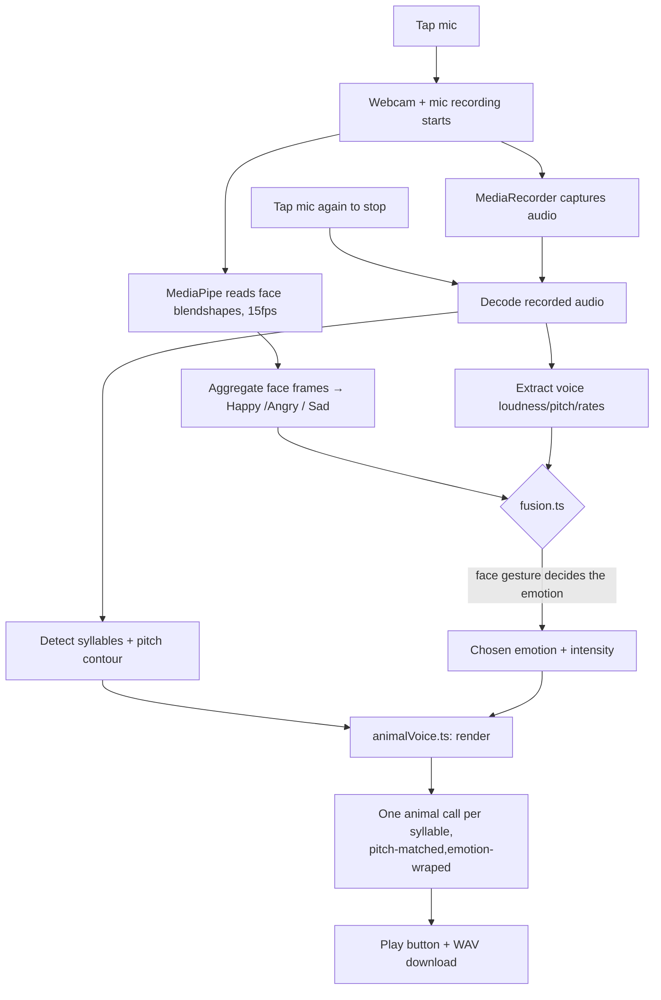

# ZOO_ODA VELAYATTAM 🐶🐱🐄🐐


## Basic Details
### Team Name: Matrix


### Team Members
- Team Lead: Noel Issac AJ - Toc H Institute of Science & Technology
- Member 2: Arjun SM - Toc H Institute of Science & Technology


### Project Description
ZOO_ODA VELAYATTAM is a completely unnecessary animal voice translator that lets you talk to your webcam and microphone and turns your voice into an animal sound

You choose an animal , make a face, say something, and the system tries to make the animal sound match your emotion, voice pitch and speaking rhythm.

### The Problem (that doesn't exist)

Have you ever wanted to know what you would sound like as a dog?

### The Solution (that nobody asked for)

We built an app that listens to your voice and watches your face.

You choose a dog , cat , cow or goat and starts talking.

The camera checks your facial expression and decides whether you look Happy ,Angry or sad . At the same time , the microphone checks things like your pitch , loudness , rhythm and syllables

The system then takes animal sound clips and modifies them to roughly follow the way you spoke.

So if you angrily say something with a rising pitch , you get an angry animal sound that follows the pattern.

Was this necessary?
No.

Does it work?
Yes.

## Technical Details

For Software:
- TypeScript
- React 19
- Vite
- Tailwind CSS v4
- Web Audio API
- MediaRecorder API
- OfflineAudioContext
- Custom Digital Signal Processing (DSP)
- Autocorrelation for pitch detection
- RMS energy and peak picking for syllable detection
- Custom FFT based audio analysis

For Hardware:
- Webcam
- Microphone
- Laptop
- Speakers

### Implementation


# Installation
```bash
npm install
npm run dev
```

Open the printed 'http://localhost:5173'

```bash
npm run build
npm run preview
```

### Project Structure
```
ZOO_ODA-VELAYATTAM
|--README.md
|--PROJECT.md
|--CREDITS.md
|--index.html
|--package.json
|--vite.config.ts
|
|--public/
|  |--background.jpg
|  |--title-banner.png
|  |--models/
|  |--wasm/
|  |--icons/
|  |--screenshots/
|  |   |--home.png
|  |   |--recording.png
|  |   |--results.png
|  |--sounds/
|    |--dog/
|    |--cat/
|    |--goat/
|    |--cow/
|
|-src/
  |--main.tsx
  |--App.tsx
  |--index.css
  |
  |--components/
  |  |--GlassPanel.tsx
  |  |--WebcamStage.tsx
  |  |--EmotionLegend.tsx
  |  |--ControlPanel.tsx
  |  |--HumanPanel.tsx
  |  |--AnimalPanel.tsx
  |  |--UtilityCluster.tsx
  |  |--Icon.tsx
  |  |--TitleBanner.tsx
  |  |--Icon.tsx
  |  |--PixelIcon.tsx
  |  |--Waveform.tsx
  |
  |--lib/
      |--capture.ts
      |--faceEmotion.ts
      |--voiceEmotion.ts
      |--audioAnalysis.ts
      |--prosody.ts
      |--fusion.ts
      |--animals.ts
      |--animalVoice.ts
      |--gloss.ts
      |--wav.ts
      |--emotionSpace.ts
      |--types.ts
```
# Screenshots 


*Main Screen where the user selects an animal and starts the recording*


*Recording screen showing the webcam and microphone being used.*


*Final animal sound generated from the user's voice and facial expression*

# Flow chart



## Team Contributions
- Noel: Main programming , audio processing , face emotion detection
- Arjun: UI/UX Design , frontend development and making the interface clean and easy to use


---
Made with ❤️ at TinkerHub Useless Projects 


